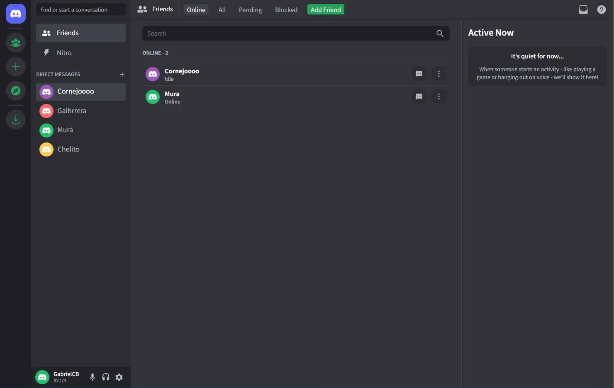

# **Discord Clone**

 

<h4 align="center" style="font-weight: 500">
Developed With
</h4>

  
  
  

  <a href="#installation">Installation</a> •
  <a href="#what-i-learned">What I learned</a>

This project is a clone of the "Friends Page" of the Discord's Web Application, it only replicates UI and is not really functional. Please note that this clone is intended for educational and personal use only and is not affiliated with or endorsed by Discord Inc. You can try the web app [here](https://gabrielcornejob.github.io/discord-clone/).

## **Installation**

If you want to try it locally follow this steps:

    # Clone this repository
    $ git clone https://github.com/GabrielCornejoB/discord-clone

    # Navigate to directory
    $ cd discord-clone

    # Install required dependencies
    $ npm install

    # Run the app
    $ npm run dev

> Even tho you can install it locally, if you just wanna check it out, go to the description of this repo and there will be a link to a hosted version.

## **What I learned**

- Using scss native variables is probably not the best way, if I would have used CSS native variables I would have saved a lot of time and a lot of "../../".
- It is really fun to copy existing UIs only, it is faster, it helps me practice my CSS skills and also understand hoy big companies create their apps.
- The way I am using mixins is also not correct, I think, maybe I'm just over-killing a lot of projects by using that. (Don't get me wrong, the base and resets files are okay, it'js just that tha variables file should be with native css variables and the mixins file maybe is not that necessary).
